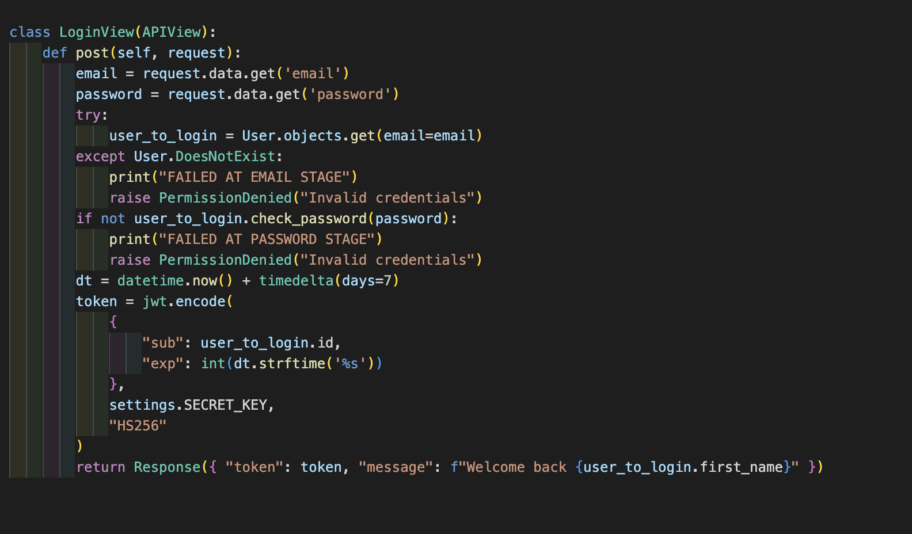
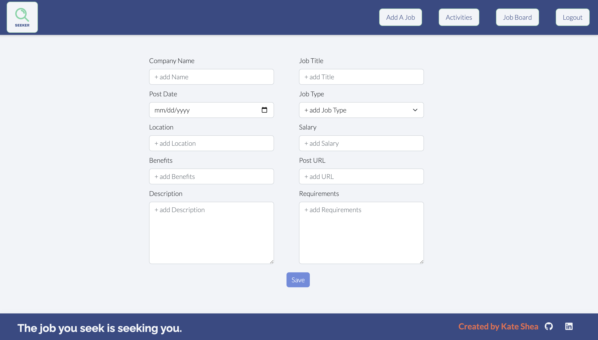

# Seeker: A React App and Django RESTful API

## Table of contents
* [Project Overview](#project-overview)
* [Deployment Link](#deployment-link)
* [Timeframe & Working Team](#timeframe-and-working-team) 
* [Technologies & Frameworks Used](#technologies-and-frameworks-used)
* [Brief](#brief)   
* [Planning](#planning)
* [Build Process](#build-process)
* [Bugs](#bugs)
* [Future Improvements](#future-improvements) 

## Project Overview  

Seeker is a job application tracking app. Once registered, users can save potential jobs with details and import company information from LinkedIn. Once a job is added, they can track application progress by updating its status, add contacts, and write notes. For each job, the user can add activities to their to-do list with deadlines and later sort through activities by job or by date. Seeker is a full stack web application built using React, Python, Django, and PostgreSQL. 

## Deployment Link
The app has been deployed using Render is available [here.]( https://bit.ly/kdshea-seeker/)
 

## Timeframe and Working Team
* Solo Project
* 7-day timeframe

## Technologies and Frameworks Used 

__Front End__
* Axios
* CSS3
* HTML5
* JavaScript
* JSX
* React Bootstrap 
* React Router DOM
* React.js
* SASS

__Back End__ 
* Python
* Django
* Django REST Framework
* PostgreSQL
* psycopg2
* pyJWT

__Deployment__ 
* Heroku 
* Render 

__Other__
* Chrome developer tools
* DrawSQL (database schema diagram)
* Figma
* Git & GitHub
* Insomnia
* TablePlus

## Brief
* Build a full-stack application by making your own backend and your own front-end
* Use a Python Django API using Django REST Framework to serve your data from a Postgres database
* Consume your API with a separate front-end built with React
* Be a complete product which most likely means multiple relationships and CRUD functionality for at least a couple of models

## Planning
* I started by defining my minimum viable product and stretch goals. I looked at some job search sites like [Huntr](https://huntr.co/) and [Teal](https://www.tealhq.com/) for inspiration of how the user would navigate through the site. 

### Minimum Viable Product (MVP): 
  * User can register, login, and logout.
  * User can save a job, and for each job they can save company information, notes, contacts, and activities. They should be able to edit and delete all of this information. 
  * There will a job board where the user can view an index of all their saved jobs
  * There will be an activity board where the user can view an index of all activities across all their jobs

     Stretch Goals:
	* Import company data from API and use it to autofill the add company form
	* Add a document upload 
	* Filter jobs by application status
	* Filter activities by date or completion status

### [Entity Relationship Diagram](https://drawsql.app/teams/kates-team-1/diagrams/seeker)
*  I used DrawSQL to make an ERD for the SQL database that showed the tables and relationships. The diagram above shows the one-to-many and one-to-one relationships between the user, job, company, activity, document, contact, and note models. From there I outlined the structure for the API apps and endpoints I needed. Next, I made a list of React components I would need on the front end to accomplish my MVP and create the user journey I wanted. I found a few third-party APIs I wanted to incorporate if time allowed. One was a FileStack API to upload documents and the other was a LinkedIn API to import company information from their LinkedIn URL.

### View Methods for Each API App
1. Users & Auth: Register, Login
2. Jobs: Create, Update, Delete, Get all, Get by status
3. Companies: Create, Update, Delete, Get by id
4. Activities: Create, Update, Delete, Get all, Get by due_date, Get by job_id, Get by completed_status
5. Notes: Create, Update, Delete, Get by job_id
6. Contacts: Create, Update, Delete, Get by job_id, Get by company_id
7. Documents: Create, Update, Delete, Get by job_id

### Front End Components
* Landing Page
* Register 
* Login
* Job Board (index page of all jobs)
	* filter by job_status
* Activity Board (index of all activities)
	* filter by due_date, completed_status
* Single Job Page
  (Need forms to add/edit each of these)
  * Job Details
  * Activities filtered by job_id
  * Note
  * Contacts filtered by job_id
  * Documents filtered by job_id
    * API to upload dcocuments
  * Company
    * API to import company data from LinkedIn

### Wireframes

* At this point, I wanted to make my wireframes. I created a brand kit with a color palette, a logo, some stock images, fonts, and icons then got to work in Figma drawing them out. The complete Figma wireframes for desktop can be viewed [here](https://www.figma.com/proto/K9ZetiU5iRBXOuU7JLIUbX/Seeker?node-id=44%3A1774&scaling=min-zoom&page-id=44%3A1772) and the wireframes for mobile can be view [here.](https://www.figma.com/proto/K9ZetiU5iRBXOuU7JLIUbX/Seeker?node-id=17%3A161&scaling=scale-down&page-id=0%3A1) Some wireframe examples are included below.

* Landing Page Wireframe

* Register Wireframe

* Login Wireframe

* Activity Index Wireframe

* Job Index Wireframe

## Build Process

* Day 1 and 2
  * I spent a lot of time creating Figma wireframes, but I felt this actually saved me time in the long run. It made the styling go so much faster because I had a specific design to recreate and I had to think about all the inputs I needed for each page which later made creating the forms in React much quicker. I worked out all the database relationships in the entity relationship diagram, then got started by creating a Django project. I used pyscopg2 to access the PostgreSQL database, TablePlus to visualize the database, and Insomnia to test. 
  * I had 7 apps: jobs, activities, companies, contacts, documents, notes, and jwt_auth. For each I created the model, common serializers, URLs, and view methods to get, create, update, and delete.

  * The code blocks belower are examples fo the model and serializers from the comany app:
    * Company Model
    
    * Company Common Serializer
    
    * Company Populated Serializer
    

  * Here are the URLs from the Django project to each of the apps, and the URLs for the activity app:
    * Project URLs
    
    * Activity URLs: The primary key (pk) for the ActivityDetailView is the activity id. The pk for the ActivityByJobView is the job id. The pk from the ActivityByStatusView is a boolean where true indicates the activity is completed.
    

    * Screenshot example of views

    * Activity List Views: The first view get method here returns all of the activities, sorted by id number and then by completed status. The second view post method creates a new activity.
    

    * Activity Status Views: The views here use the boolean from the URL as a primary key to filter for activities that match that complete status. 
    

    * Activity Past-Due Views: To filterfor past due activities, I set the due date filter to less than (due_date__lt) the current date by using datetime.date(now). Similarly, in the view method for upcoming activities I filtered for due dates that were greater than or equal to (due_date__gte) the current datetime. 
    

  * Below is list of the Insomnia tests I used to check the get requests across all the apps. 
    

* Day 3
  * Now that the back end and my database were functional, I used npm to create a React app and nested it in inside the Django project. I made files and routes for all the front end components and starting building them out. I used Axios for the requests to the back end. I used react-router-dom to navigate between pages. Below are all the routes in App to all the front end components.

    * Routes
    

  * I finished building the navbar, footer, landing page, login, and register pages. I started working on job index and activity index pages. I needed to go back and make populated serializers. For all of the populated serializers, I needed to add the userSerializer as the owner to use for authentication. In the job populated serializer, I needed activities    * Serializer: Need activities and company in jobs,
  * serializer: Need company and job in activities

* Day 4
  * I went back to the back end and finished authentication for all views. I used simple JSON web token based authentication. I made a custom user model in the jwt_auth app with fields for first_name, last_name, and email. When registered users login with the correct credentials, the jwt_auth login view method responds with an encoded token. 
  
  * jwt_auth Login Method
  
  
  * The setToken function on the front end stores the response in local storage. This saved token will be used as a header for requests to the back end to show the user is authenticated. The getPayLoad function splits up the encoded token and the user id as a string can be saved by using payLoad.sub.toString(). 
  

  * Front End Authentication Checks
  
  
  * For every view method except login and register, I have permission_classes = [IsAuthenticated] to check if the user is logged in. For the get all views, the API responses are filtered to only jobs and activities that the user in the request is the owner of. For the view methods that get jobs or activities by id, the back end checks that if the user in the request is the owner, and if not responds PermissionDenied("Unauthorized"). 

* Day 5

  * I continued working on React components for the front end. I made 6 form pages to add new jobs, activities, companies, contacts, notes, and documents and 6 pages to display existing jobs. To make the pages to edit each component, I had a useEffect to get the existing data on the page load to prepopulate the forms. Then I have a handleChange function that spreads in the old form data then updates it with the new values. The code block below shows an exampled of the useEffect to get data and the handleChange and handleSubmit to post the new data after editing.

  * Edit Note Form Populated with Get Request and Updates with Post Request
  

  * Next, I made secondary navigation bars for the job index page and the activity index page. For the job index navbar, the user can navigate between jobs by status (all, applied, interview, offer, declined). For the activity index navbar, the user can navigate by due date and completed status (all, due today, past due, incomplete, complete). Clicking on the Nav link sets a filter variable in a useEffect and that variables is used in an axios request. Example code from the filters for the activity nav bar is shown in the blocks below. 

  * Activity Nav Bar Filters
  
  * Activity Filter Axios Request
  

* Day 6 & 7
  * I worked on styling all the pages, trying to stay relatively close to my original wireframes. I created some seed data and saved it for demo purposes. 
  * At this point, I had met my MVP and had some time left. I was able to go to the activiy index and add check boxes that would update the completed_status when the box was ticked or unticked. 
  * I orginally deployed using Heroku. Below are screenshots of the completed project with seed data. 

* Register Page

* Job Index Page

* Activity Index Page

* Add Job Page

* Job Detail Page

* Add Company Page

* Company Detail Page

* Job Activities

* Add Note Page

* Note Detail Page

* Add Contact Page

* Contacts Page

## Bugs

* The LinkedIn company data import API doesn’t work for smaller companies, and the response can be slow.
* On the page for all activities, there are tabs at the top to filter the activity list by date or completion status. If you click a checkbox to change the completion status of an activity, the page re-renders and the tabs stop showing which filter criteria is applied.

## Future Improvements

* Things that could be added in the future:
	* File upload for documents like cover letter or CV that were tailored for that job listing
	* Job search statistics
	* Add a spinner when importing company info from third-party API because response can be slow
	* Email reminders for upcoming tasks
	* A search bar to go through job descriptions
	* Error message handling from API responses by looping through error.data.detail

